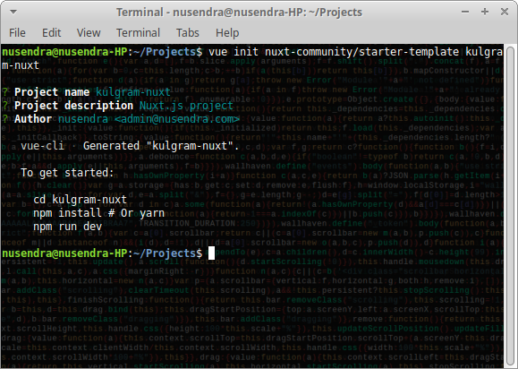
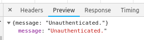
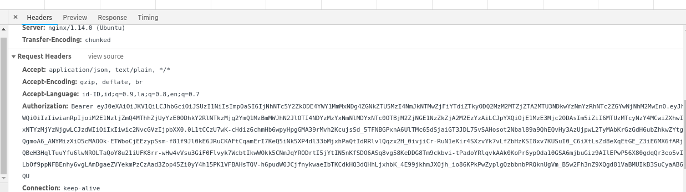

<h1 align="center">LARAVEL API - NUXTJS (VUEJS)</h1>

<p align="center">
  Cara mudah Nuxtjs untuk mengkonsumsi data dari Laravel API, melakukan post dan delete data. Serta cara mudah untuk melakukan autentikasi di Nuxtjs dan Laravel Passport
</p>

<p align="center"><strong> Level : Beginner -> Intermediate </strong></p>

# Daftar isi
- Penjelasan Laravel API sebagai backend
- Apa itu Nuxtjs?
- Menggunakan Laravel Passport
- Install Laravel CORS
- Instalasi Nuxtjs sebagai frontend
- Instalasi Axios di Nuxtjs
- Autentikasi
- CRUD di Nuxtjs dan Laravel API

<hr>

Assalamu'alaikum warahmatullahi wabarakatuh,

Sebelum memulai kulgram, perkenalkan saya Nusendra Hanggarawan. Sebagai catatan disini saya mau share ilmu saja. Jika nanti kalau ada salah kata atau kekeliruan, mohon dimaklumi. 😊

Bagi yang udah pinter, tolong saya jangan di bully ya hehehe. Semoga materi yang saya share berguna buat temen-temen semua. Aamiiinn.

Kulgram kali ini, insya allah bakal panjang. Siapkan camilan dan minuman (~~Kental Manis~~ susu / kopi).

Pertama tama, apa sih Laravel API itu? Laravel sebagai framework PHP monolith yang bisa dipakai untuk membangun web app sebagai backend dan frontend nya (Blade). Namun kali ini kita hanya memanfaatkan Laravel sebagai service nya saja (API), untuk frontend kita serahkan ke framework JS yang mumpuni di bidang nya, yakni Vuejs. Kenapa vuejs? Karena Laravel sendiri sudah membundle project nya dengan Vuejs.

Namun kali ini kita tidak membahas vuejs yang sudah jadi satu dengan Laravel nya ya, tetapi ini frontend dan backend kita pisahkan repo nya. Dan kali ini kita gak akan spesifik memakai Vuejs nya, tetapi kita akan pakai Nuxtjs.

<hr>

### Penjelasan Laravel API sebagai backend

Seperti yang kita tahu, Laravel sering kita jadikan sebagai PHP framework untuk membangun halaman website yang terdiri dari backend dan frontend sekaligus. Nah disini kita akan memanfaatkan Laravel sebagai backend nya saja. Laravel akan menerima request dan mengirimkan response berupa JSON yang nantinya akan di konsumsi oleh frontend (Nuxtjs).

### Apa itu Nuxtjs?

Tahu HulkBuster ya?


**Tony Stark = Javascript (Jquery)**

Cocok dipasang di blade, untuk menampilkan website sederhana dan tanpa perlu memperhitungkan halaman web yang reaktif. Ini tergolong simple, karena kita lebih banyak hanya bermain di php blade. Jquery hanya sebagai pendukung (Post data).

**Iron Man = Vuejs**

Memisahkan frontend dan backend adalah pilihan yang bagus untuk membangun web modern. Kita ga bisa hanya mengandalkan blade saja, karena di Vuejs kita bisa dapat banyak manfaat seputar frontend, salah satu nya SPA (Single Page Application).

**Hulkbuster = Nuxtjs**

Membangun UI dengan vuejs as frontend sangat disarankan, tetapi kadang kita akan merasa kesulitan dan ada konfigurasi serta settingan manual di webpack untuk mendapatkan UI / UX yang diinginkan, disini Nuxtjs hadir untuk menyederhanakan semua nya. Salah satu nya, di vuejs kita wajib memakai vue-router untuk berpindah halaman, di Nuxtjs kita tidak butuh itu. Hanya dengan menaruh file di folder pages, otomatis akan dibaca sebagai route.

Mungkin ada yang bertanya, apakah pake Nuxt kita perlu belajar Vue dulu? Saya katakan, `gak perlu`. Karena kita belajar Nuxt sama aja dengan belajar Vue, mungkin perbedaan yang paling menonjol ada pada struktur folder nya saja.

> Disini saya gak akan bahas detail tentang vue, seperti component, reusable component, child and parent conponent, state, props, computed properties, watcher, dll. Silakan teman - teman belajar sendiri.

### Menggunakan Laravel Passport

Karena kulgram ini bakalan panjang, untuk instalasi silakan mampir ke docs nya saja di https://laravel.com/docs/5.6/passport

Laravel passport berfungsi sebagai jembatan untuk mengotentikasi user yang sedang menggunakan web app. Jika pada Laravel monolith (backend dan frontend jadi satu), kita bisa menggunakan session untuk mengenali user. Tetapi jika Laravel sebagai backend, kita perlu mengirimkan token yang sudah terotentikasi agar laravel bisa mengenali si user. 

Ok kita langsung ke implementasi. Pastikan dahulu passport sudah terinstall dengan benar dan berjalan dengan baik.

Buat route di `api.php` seperti berikut .

```
Route::post('/login', 'UserController@login');

Route::group(['middleware' => ['auth:api']], function () {
  Route::apiResources([
    '/user'   => 'UserController',
    // ini untuk route api lainnya....
  ]);
});
```

untuk `/login`, kita tidak perlu untuk mencantumkan token, karena memang kita belum dapat token api nya. Maka route login ini kita taruh di luar group middleware.

Sedangkan untuk route `/user` kita perlu mencantumkan token yang sudah terotentikasi, maka route `/user` kita masukkan ke group middleware, sehingga nanti user yang belum terotentikasi tidak bisa melihat list user.

kemudian pada model user, silakan tambahkan script dibawah ini

```
<?php

namespace App;

use Laravel\Passport\HasApiTokens;
use Illuminate\Notifications\Notifiable;
use Illuminate\Foundation\Auth\User as Authenticatable;

class User extends Authenticatable
{
    use HasApiTokens, Notifiable;

    protected $fillable = [
        'nama_user', 'email', 'pwd',
    ];
}
```
Untuk register, kita bisa melakukan insert data user seperti biasa di laravel. Untuk register kita skip dulu, karena akan menambah waktu di kulgram kita kali ini.

kemudian pada UserController. kita tambahkan method login seperti dibawah ini :

```
user App\User;

.....


public function login(Request $request)
{
    $user = User::where('name', $request->name)->first();
    if($user){
       if (Hash::check($request->pwd,$user->pwd)) {
            return response()->json([
                'api_token'     => $user->createToken($user->name)->accessToken
            ],200);
       }else{
            return response()->json(['status' => 'fail'],401);
       }
   }else{
        return response()->json(['status' => 'fail'],401);
   }
}
```

Disini, frontend akan melakukan post data yang diarahkan ke route `/login`, kemudian data dilemparkan ke function login di UserController.php.

Oh iya, saya akan jelaskan terlebih dahulu alur kerja Auth nya.

1. Nuxt Mengirim data yang berisi nama dan password untuk login menggunakan axios.
2. Di UserController, function login mencari 1 data user yang mana nama nya sesuai dengan `$request->name`.
3. Jika ketemu, maka kita `hash` kan `$request->pwd` kemudian dicocokkan apakah pwd yang dikirim cocok dengan hashed password si user.
4. Jika cocok, maka backend akan mengirimkan response dengan type json yang berisi token.
5. Setelah Nuxt mendapat response, dia menyimpan token nya di cookies / localstorage.

### Instalasi Laravel CORS

Bagi yang belum tau apa kegunaan CORS, silakan gugling dulu. Singkat nya CORS ini diperlukan jika project kita berbeda repo / folder antara backend dan frontend. Misalkan kita bikin web app dengan laravel sebagai backend nya, dan vuejs sebagai frontend nya. Maka kita perlu install CORS di Laravel, agar request dari frontend dapat di terima oleh backend.

Silakan mampir kesini untuk petunjuk instalasinya 
https://github.com/barryvdh/laravel-cors

### Instalasi Nuxtjs sebagai frontend

Docs lengkap bisa mampir kesini https://nuxtjs.org/guide/installation

Oh iya, harus install nodejs dan npm dulu ya. Caranya silakan gugling dulu.

Jika belum pernah install vue-cli, jalankan perintah berikut ini
```
$ npm install -g @vue/cli @vue/cli-init
```

Kemudian create project nya
```
$ vue init nuxt-community/starter-template <project-name>
```



```
$ cd <project-name>
$ npm install
```


```
$ npm run dev
```


Nanti di chrome teman - teman bakal muncul halaman default nya nuxtjs.

### Instalasi Axios di Nuxtjs

Docs lengkap mampir kemari https://axios.nuxtjs.org/

Untuk melakukan kirim - terima data melalui ajax, kita bisa menggunakan axios. Cara install nya seperti dibawah ini

```
$ npm install @nuxtjs/axios
```

Kemudian masuk ke file `nuxt.config.js` dan tambahkan baris berikut
```
modules: ["@nuxtjs/axios"],
axios: {
  baseURL: "http://localhost/api",
  credentials: false
},
```

Instalasi selesai. Berikutnya kita coba untuk melakukan login.

### Autentikasi

Buat file `login.vue` di dalam folder pages. Kemudian bikin script seperti dibawah ini

```
<template>
  <div>
    nama: <input v-model="nama"/><br>
    pwd: <input v-model="pwd" type="password"/><br>
    <button @click="login">Login</button>
  </div> 
</template>

<script>
export default {
  data: () => ({
    nama: null,
    pwd: null
  }),
  methods: {
    login() {
      this.$axios.post('/login', {
        name: this.nama,
        pwd: this.pwd
      }).then(response => {
        localStorage.setItem("api_token", response.data.api_token);
      })
    }
  }
}
</script>
```

Kemudian pergi ke halaman login nya dengan mengetikkan ini di browser
```
http://localhost:3000/login
```


Ketik nama dan password, kemudian klik tombol login. Perhatikan di dalam devtools di tab application -> localstorage. Disana token akan tersimpan dan siap untuk digunakan.


Sampai sini proses auth berhasil. 

### CRUD di Nuxtjs dan Laravel API

Pertama kita tes terlebih dahulu Laravel passport kita. Buatlah sebuah route diluar group middleware auth.

```
Route::get('/users', 'UserController@getAll');
```
Setelah itu tambahkan method getAll di controller
```
public function getAll()
{
  $user = User::all();
  return $user;
}
```

Tambahkan button Get All User untuk mendapatkan data user
```
<button @click="getAll">Get All User</button>
```
Kemudian di dalam login.vue methods tambahkan fungsi berikut

```
getAll() {
  this.$axios.get('/users').then(response => {
    console.log(response.data);
  })
}
```


Karena route tadi ada di luar middleware group (yang artinya dia gak akan diperiksa otentikasi nya), maka backend langsung memberikan semua data user.
<hr>

Sekarang coba masukkan route tadi kedalam group middleware 

```
Route::group(['middleware' => ['auth:api']], function () {
    Route::get('/users', 'UserController@getAll');
    .......
```

Kemudian coba di klik tombol Get All, maka akan muncul error seperti berikut.



Hal ini terjadi karena kita belum setting token header di axios nya. Untuk itu kita harus setting axios agar mencantumkan api token di setiap request yang keluar

Pertama buat file `axios.js` di folder plugins, kemudian isikan persis seperti dibawah ini
```
export default function ({ $axios }) {
  $axios.onRequest(config => {
    config.headers.common['Authorization'] = 'Bearer ' + localStorage.getItem('api_token')
  })
 }
```
Kemudian buka file `nuxt.config.js`, tambahkan sebagai berikut

```
plugins: ['~/plugins/axios'],
```
Kita coba tes lagi klik button Get All. Nanti akan muncul seperti ini di request header nya



Dan akan muncul hasil nya 


Nah disini Nuxtjs kita sudah ready, setiap proses request sudah include header. Tinggal bagaimana kita mengembangkan frontend nya.

**Berikut ini script untuk proses CRUD dengan axios**

`CREATE`
```
this.$axios.post('/user',{
  param1: this.param1,
  param2: this.param2
}).then(response => {
  console.log(response.data);
})
```

`READ`
```
this.$axios.get('/user').then(response => {
  console.log(response.data);
})
```

`UPDATE`
```
this.$axios.put('/users/1', {
  param1: this.param1,
  param2: this.param2
}).then(response => {
  console.log(response.data);
})
```

`DELETE`
```
this.$axios.delete('/user/1').then(response => {
  console.log(response.data);
})
```

<hr>

> Sebagai catatan, untuk proses auth di nuxt lebih baik menggunakan auth module yang sudah di sediakan oleh tim nuxt. Bisa diakses disini https://github.com/nuxt-community/auth-module. Tetapi disini saya hanya mau share secara konsep bagaimana auth dilakukan di nuxt (terlebih karena gak bahas nuxt secara detail). Kalau untuk project serius, disarankan pakai auth module.
> 
Sekian kulgram kali ini, fiuhh panjang ya. Jika temen - temen masih ada pertanyaan masalah Nuxt / Vue dengan Laravel, boleh langsung tanya tanya disini, atau bisa PM kalo mau.

Mohon maaf jika ada kesalahan dan kekeliruan dari saya. Terima kasih

Wassalamu'alaikum warahmatullahi wabarakatuh.

_**Penulis:** [Nusendra Hanggarawan](https://github.com/nusendra)_
