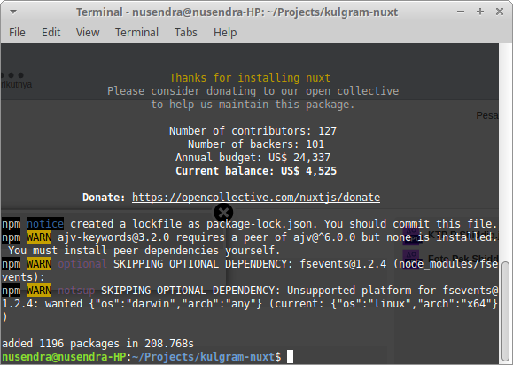
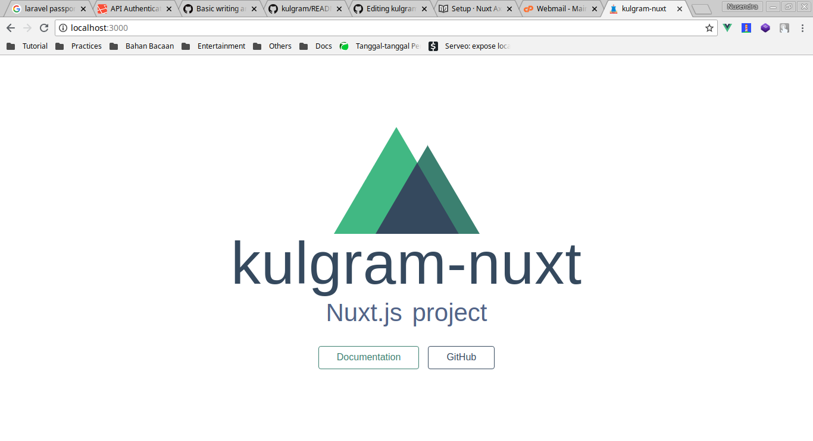
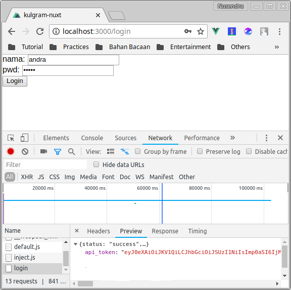
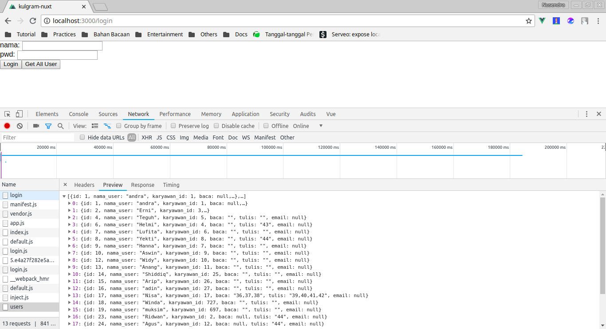

<h1 align="center">Mengonsumsi Laravel API dengan Nuxt.js (Vue.js)</h1>

<p align="center">
  Cara mudah Nuxt.js untuk mengonsumsi data dari Laravel API, melakukan post dan delete data. Serta cara mudah untuk melakukan autentikasi di Nuxt.js dan Laravel Passport.
</p>

<p align="center"><strong>Tingkat: Pemula-Menengah</strong></p>

# Daftar isi

- [Penjelasan Laravel API sebagai Back-End](#penjelasan-laravel-api-sebagai-back-end)
- [Apa itu Nuxt.js?](#apa-itu-nuxtjs)
- [Menggunakan Laravel Passport](#menggunakan-laravel-passport)
- [Instalasi Laravel CORS](#instalasi-laravel-cors)
- [Instalasi Nuxt.js sebagai Front-End](#instalasi-nuxtjs-sebagai-front-end)
- [Instalasi Axios di Nuxt.js](#instalasi-axios-di-nuxtjs)
- [Autentikasi](#autentikasi)
- [CRUD di Nuxt.js dan Laravel API](#crud-di-nuxtjs-dan-laravel-api)

<hr>

Assalamu'alaikum warahmatullahi wabarakatuh,

Sebelum memulai kulgram, perkenalkan saya Nusendra Hanggarawan. Sebagai catatan di sini saya mau share ilmu saja. Jika nanti kalau ada salah kata atau kekeliruan, mohon dimaklumi. 😊

Bagi yang udah pinter, tolong saya jangan dibully ya hehehe. Semoga materi yang saya share berguna buat temen-temen semua. Aamiiinn.

Kulgram kali ini, insya allah bakal panjang. Siapkan camilan dan minuman (~~Kental Manis~~ Susu atau Kopi).

Pertama tama, apa sih Laravel API itu? Laravel sebagai framework PHP monolith yang bisa dipakai untuk membangun web app sebagai Back-End dan Front-End nya (Blade). Namun kali ini kita hanya memanfaatkan Laravel sebagai service nya saja (API), untuk Front-End kita serahkan ke framework JS yang mumpuni di bidang nya, yakni Vue.js. Kenapa Vue.js? Karena Laravel sendiri sudah membundle project nya dengan Vue.js.

Namun kali ini kita tidak membahas Vue.js yang sudah jadi satu dengan Laravel nya ya, tetapi ini Front-End dan Back-End kita pisahkan repo nya. Dan kali ini kita gak akan spesifik memakai Vue.js nya, tetapi kita akan pakai Nuxt.js.

<hr>

### Penjelasan Laravel API sebagai Back-End

Seperti yang kita tahu, Laravel sering kita jadikan sebagai PHP framework untuk membangun halaman website yang terdiri dari Back-End dan Front-End sekaligus. Nah di sini kita akan memanfaatkan Laravel sebagai Back-End nya saja. Laravel akan menerima request dan mengirimkan response berupa JSON yang nantinya akan dikonsumsi oleh Front-End (Nuxt.js).

### Apa itu Nuxt.js?

Tahu Hulkbuster ya?


**Tony Stark = JavaScript (jQuery)**

Cocok dipasang di Blade, untuk menampilkan website sederhana dan tanpa perlu memperhitungkan halaman web yang reaktif. Ini tergolong simple, karena kita lebih banyak hanya bermain di PHP Blade. jQuery hanya sebagai pendukung (Post data).

**Iron Man = Vue.js**

Memisahkan Front-End dan Back-End adalah pilihan yang bagus untuk membangun web modern. Kita gak bisa hanya mengandalkan Blade saja, karena di Vue.js kita bisa dapat banyak manfaat seputar Front-End, salah satu nya SPA (Single Page Application).

**Hulkbuster = Nuxt.js**

Membangun UI dengan Vue.js sebagai Front-End sangat disarankan, tetapi kadang kita akan merasa kesulitan dan ada konfigurasi serta settingan manual di Webpack untuk mendapatkan UI / UX yang diinginkan, di sini Nuxt.js hadir untuk menyederhanakan semuanya. Salah satu nya, di Vue.js kita wajib memakai vue-router untuk berpindah halaman, di Nuxt.js kita tidak butuh itu. Hanya dengan menaruh berkas di folder pages, otomatis akan dibaca sebagai route.

Mungkin ada yang bertanya, apakah pake Nuxt.js kita perlu belajar Vue.js dulu? Saya katakan, `gak perlu`. Karena kita belajar Nuxt.js sama aja dengan belajar Vue.js, mungkin perbedaan yang paling menonjol ada pada struktur folder nya saja.

> Disini saya gak akan bahas detail tentang Vue, seperti component, reusable component, child and parent component, state, props, computed properties, watcher, dll. Silakan teman-teman belajar sendiri.

### Menggunakan Laravel Passport

Karena kulgram ini bakalan panjang, untuk instalasi silakan mampir ke dokumentasinya saja di: https://laravel.com/docs/5.6/passport

Laravel Passport berfungsi sebagai jembatan untuk mengotentikasi user yang sedang menggunakan web app. Jika pada Laravel monolith (Back-End dan Front-End jadi satu), kita bisa menggunakan session untuk mengenali user. Tetapi jika Laravel sebagai Back-End, kita perlu mengirimkan token yang sudah terotentikasi agar Laravel bisa mengenali si user.

Ok kita langsung ke implementasi. Pastikan dahulu Passport sudah terinstal dengan benar dan berjalan dengan baik.

Buat route di `api.php` seperti berikut:

```php
Route::post('/login', 'UserController@login');

Route::group(['middleware' => ['auth:api']], function () {
  Route::apiResources([
    '/user'   => 'UserController',
    // ini untuk route api lainnya....
  ]);
});
```

Untuk `/login`, kita tidak perlu untuk mencantumkan token, karena memang kita belum dapat token API nya. Maka route login ini kita taruh di luar group middleware.

Sedangkan untuk route `/user` kita perlu mencantumkan token yang sudah terotentikasi, maka route `/user` kita masukkan ke group middleware, sehingga nanti user yang belum terotentikasi tidak bisa melihat list user.

Kemudian pada model user, silakan tambahkan script dibawah ini:

```php
<?php

namespace App;

use Laravel\Passport\HasApiTokens;
use Illuminate\Notifications\Notifiable;
use Illuminate\Foundation\Auth\User as Authenticatable;

class User extends Authenticatable
{
    use HasApiTokens, Notifiable;

    protected $fillable = [
        'nama_user', 'email', 'pwd',
    ];
}
```

Untuk register, kita bisa melakukan insert data user seperti biasa di Laravel. Untuk register kita skip dulu, karena akan menambah waktu di kulgram kita kali ini.

Kemudian pada `UserController`, kita tambahkan method login seperti dibawah ini:

```php
user App\User;

.....


public function login(Request $request)
{
    $user = User::where('name', $request->name)->first();
    if($user){
       if (Hash::check($request->pwd,$user->pwd)) {
            return response()->json([
                'api_token'     => $user->createToken($user->name)->accessToken
            ],200);
       }else{
            return response()->json(['status' => 'fail'],401);
       }
   }else{
        return response()->json(['status' => 'fail'],401);
   }
}
```

Di sini, Front-End akan melakukan post data yang diarahkan ke route `/login`, kemudian data dilemparkan ke function login di `UserController.php`.

Oh iya, saya akan jelaskan terlebih dahulu alur kerja Auth nya.

1. Nuxt Mengirim data yang berisi nama dan password untuk login menggunakan Axios.
2. Di `UserController`, function login mencari 1 data user yang mana nama nya sesuai dengan `$request->name`.
3. Jika ketemu, maka kita `hash` kan `$request->pwd` kemudian dicocokkan apakah pwd yang dikirim cocok dengan hashed password si user.
4. Jika cocok, maka Back-End akan mengirimkan response dengan type JSON yang berisi token.
5. Setelah Nuxt mendapat response, dia menyimpan token nya di cookies atau localstorage.

### Instalasi Laravel CORS

Bagi yang belum tau apa kegunaan CORS, silakan gugling dulu. Singkatnya CORS ini diperlukan jika project kita berbeda repo/folder antara Back-End dan Front-End. Misalkan kita bikin web app dengan Laravel sebagai Back-End nya dan Vue.js sebagai Front-End nya. Maka kita perlu install CORS di Laravel, agar request dari Front-End dapat diterima oleh Back-End.

Silakan mampir kesini untuk petunjuk instalasinya: https://github.com/barryvdh/laravel-cors

### Instalasi Nuxt.js sebagai Front-End

Dokumentasi lengkap bisa mampir kesini: https://nuxtjs.org/guide/installation

Oh iya, harus install Node.js dan npm dulu ya. Caranya silakan gugling dulu.

Jika belum pernah install vue-cli, jalankan perintah berikut ini:

```shell
$ npm install -g @vue/cli @vue/cli-init
```

Kemudian create project nya:

```shell
$ vue init nuxt-community/starter-template <project-name>
```


```shell
$ cd <project-name>
$ npm install
```



```shell
$ npm run dev
```




Nanti di Chrome atau Chromium teman-teman bakal muncul halaman default nya Nuxt.js.

### Instalasi Axios di Nuxt.js

Dokumentasi lengkap mampir kemari: https://axios.nuxtjs.org/

Untuk melakukan kirim-terima data melalui AJAX, kita bisa menggunakan Axios. Cara install nya seperti di bawah ini:

```shell
$ npm install @nuxtjs/axios
```

Kemudian masuk ke berkas `nuxt.config.js` dan tambahkan baris berikut:

```javascript
modules: ["@nuxtjs/axios"],
axios: {
  baseURL: "http://localhost/api",
  credentials: false
},
```

Instalasi selesai. Berikutnya kita coba untuk melakukan login.

### Autentikasi

Buat berkas `login.vue` di dalam folder pages. Kemudian bikin script seperti di bawah ini:

```vue
<template>
  <div>
    nama: <input v-model="nama"/><br>
    pwd: <input v-model="pwd" type="password"/><br>
    <button @click="login">Login</button>
  </div> 
</template>

<script>
export default {
  data: () => ({
    nama: null,
    pwd: null
  }),
  methods: {
    login() {
      this.$axios.post('/login', {
        name: this.nama,
        pwd: this.pwd
      }).then(response => {
        localStorage.setItem("api_token", response.data.api_token);
      })
    }
  }
}
</script>
```

Kemudian pergi ke halaman login nya dengan mengetikkan ini di browser

```
http://localhost:3000/login
```



Ketik nama dan password, kemudian klik tombol login. Perhatikan di dalam DevTools di tab Application -> Local Storage. Di sana token akan tersimpan dan siap untuk digunakan.


Sampai sini proses auth berhasil.

### CRUD di Nuxt.js dan Laravel API

Pertama kita tes terlebih dahulu Laravel Passport kita. Buatlah sebuah route diluar group middleware auth.

```php
Route::get('/users', 'UserController@getAll');
```

Setelah itu tambahkan method `getAll` di controller

```php
public function getAll()
{
  $user = User::all();
  return $user;
}
```

Tambahkan button Get All User untuk mendapatkan data user

```html
<button @click="getAll">Get All User</button>
```

Kemudian di dalam `login.vue` methods tambahkan fungsi berikut:

```javascript
getAll() {
  this.$axios.get('/users').then(response => {
    console.log(response.data);
  })
}
```



Karena route tadi ada di luar middleware group (yang artinya dia gak akan diperiksa otentikasi nya), maka Back-End langsung memberikan semua data user.
<hr>

Sekarang coba masukkan route tadi ke dalam group middleware

```php
Route::group(['middleware' => ['auth:api']], function () {
    Route::get('/users', 'UserController@getAll');
    .......
```

Kemudian coba diklik tombol Get All, maka akan muncul error seperti berikut:


Hal ini terjadi karena kita belum setting token header di Axios nya. Untuk itu kita harus setting Axios agar mencantumkan API token di setiap request yang keluar.

Pertama buat berkas `axios.js` di folder plugins, kemudian isikan persis seperti di bawah ini:

```javascript
export default function ({ $axios }) {
  $axios.onRequest(config => {
    config.headers.common['Authorization'] = 'Bearer ' + localStorage.getItem('api_token')
  })
 }
```

Kemudian buka berkas `nuxt.config.js`, tambahkan sebagai berikut:

```javascript
plugins: ['~/plugins/axios'],
```
Kita coba tes lagi klik button Get All. Nanti akan muncul seperti ini di request header nya:


Dan akan muncul hasil nya:


Nah di sini Nuxt.js kita sudah ready, setiap proses request sudah include header. Tinggal bagaimana kita mengembangkan Front-End nya.

**Berikut ini script untuk proses CRUD dengan Axios**

**CREATE**

```javascript
this.$axios.post('/user',{
  param1: this.param1,
  param2: this.param2
}).then(response => {
  console.log(response.data);
})
```

**READ**

```javascript
this.$axios.get('/user').then(response => {
  console.log(response.data);
})
```

**UPDATE**

```javascript
this.$axios.put('/users/1', {
  param1: this.param1,
  param2: this.param2
}).then(response => {
  console.log(response.data);
})
```

**DELETE**

```javascript
this.$axios.delete('/user/1').then(response => {
  console.log(response.data);
})
```

<hr>

> Sebagai catatan, untuk proses auth di Nuxt lebih baik menggunakan auth module yang sudah disediakan oleh tim Nuxt. Bisa diakses di sini https://github.com/nuxt-community/auth-module. Tetapi di sini saya hanya mau share secara konsep bagaimana auth dilakukan di Nuxt (terlebih karena gak bahas Nuxt secara detail). Kalau untuk project serius, disarankan pakai auth module.

Sekian kulgram kali ini, fiuhh panjang ya. Jika temen-temen masih ada pertanyaan masalah Nuxt atau Vue dengan Laravel, boleh langsung tanya-tanya [di sini](https://t.me/laravelindonesia), atau bisa [PM](https://t.me/nusendra) kalo mau.

Mohon maaf jika ada kesalahan dan kekeliruan dari saya. Terima kasih.

Wassalamu'alaikum warahmatullahi wabarakatuh.

_**Penulis:** [Nusendra Hanggarawan](https://github.com/nusendra)_
